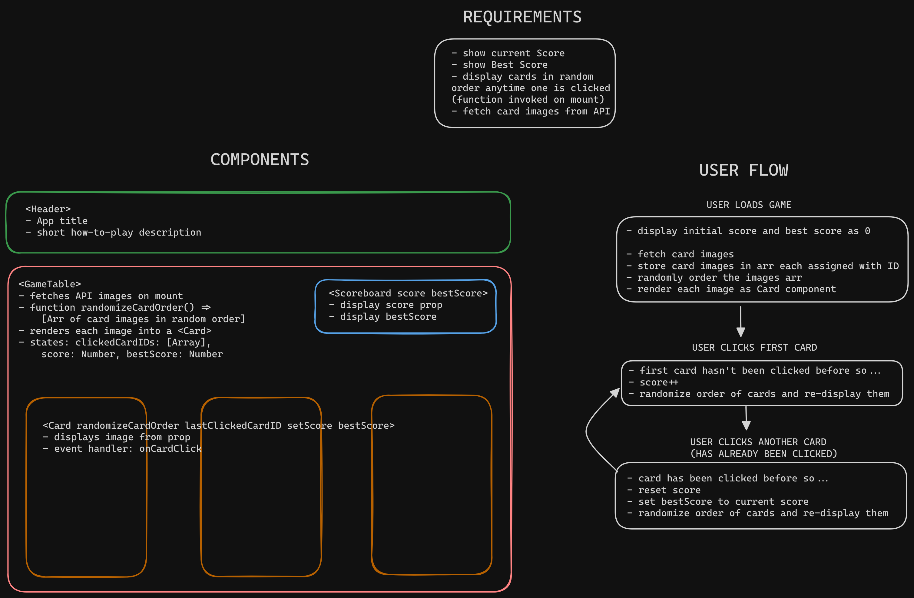

# CMemory Card

<!-- [Live Demo]() -->

## Purpose

Practice using React hooks (useState and useEffect) to manage states while fetching and using data from an external API.

## Planning

Plan I made to work out the component structure and user flow through the app:

